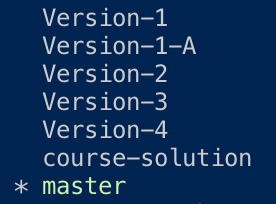

# Template_Engine-Employee_Summary
Object Oriented Programming (OOP) using classes.

## Purpose
Provides different solutions for study based on current level of programming. Assumes knowledge of basic of JavaScript (variables & references, function definitions and calls, ES6, template literals) and the npm packages fs, path, and Inquirer. More advanced solutions utilize object destructuring, promises and async/await.

Primary focus of these branches are concerned with `app.js` logic. HTML remains the same per branch, but could also have been solved in many different ways! 

## Set Up

1. Clone repo locally

2. Install dependencies (inquirer, jest)
```
npm i
```
3. Run `git branch`. 
* A `*` will identify the branch you're currently on:
<br>
<br>

<br>

*  To view the code in other branches, run:
```
git checkout branch-name
```

4. See section _**Branches**_ to determine which branch correlates to your level of study. 

## Usage

```
node app.js
```

## Branches

### Master
    * "Basic Functions" - Each function prompts questions, instantiates employee, then pushes new employee to team array.
    * Final team (array) passed to displayHTML()
    * Minimal promise use - The only promises used are those provided by Inquirer.


### Version-2
    * Functions adapted with promises & async/await
    * Functions remain separate per employee type

### Version-3
    * Consolidated functions
    * Modified data structure of employeeTypeQuestions 
    * Classes modified to accept object when instantiated

### Version-4
    * Classes can accept either an object or arguments when instantiated
